 
# GameShield
GameShield는 주로 Unity 엔진 기반의 게임을 치트(Cheat), 메모리 조작, 스피드핵, 코드 변조 등으로부터 보호하기 위해 만들어진 오픈소스 보안/안티치트 툴킷입니다  

# 설치
[```게임실드 깃 주소```]( https://github.com/DevsDaddy/GameShield)  
해당 깃 주소에 들어가서 ``Realeases``로 들어간다.
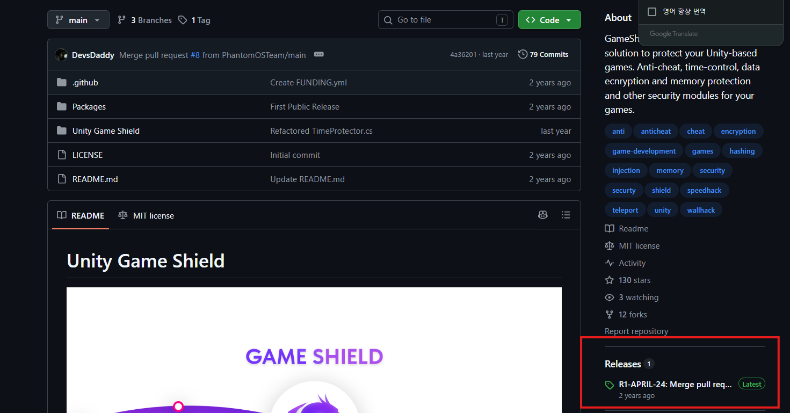
- 최신 버전의  UnityPackage를 다운받습니다.
- 유니티 패키지를 설치 후 상단에 GameShield 버튼이 생긴다.
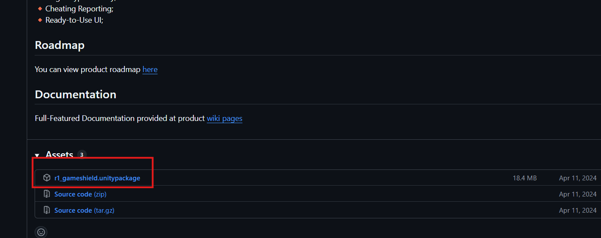
# 설정
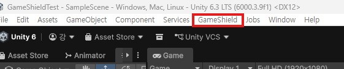
- 클릭 후 Setup wizzard를 클릭한다.  
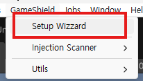
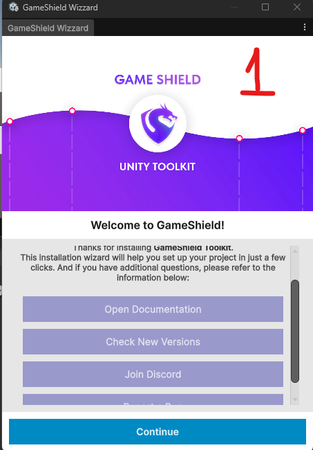
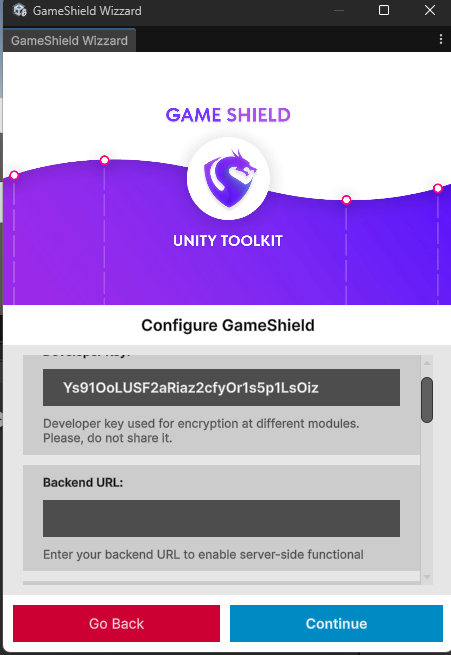
- Developer Key: 역할: 다양한 보안 모듈(메모리 암호화, 파일 저장 암호화 등)에서 암호화/복호화를 진행할 때 사용하는 고유 암호화 키입니다

- backend URL :역할: 서버 연동 기능(서버 측 검증, 제재 목록 전달, 핵 감지 로그 전송 등)을 활성화하기 위해 내 백엔드 서버의 URL 주소를 입력하는 곳입니다.
    - 참고: 서버 측 검증 기능 없이 클라이언트 단독 보안만 쓸 경우에는 비워두거나 기본값으로 진행해도 됩니다.


- Auto pause on terminated
    - 사용자가 게임 앱을 최소화하거나 다른 창을 클릭해 포커스가 벗어났을 때 GameShield의 보안 감지 로직을 잠시 멈춥니다.  

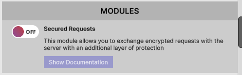
- Secured Requests (안전한 요청 모듈): 게임 앱에서 백엔드 서버로 데이터를 보낼 때, 중간에 데이터를 훔쳐보거나 변조하는 공격(Man-in-the-Middle, 패킷 변조 등)을 막기 위해 요청 통신 전체를 암호화 레이어로 감싸는 기능입니다.

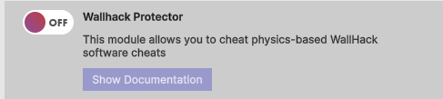
-  Wallhack Protector (월핵 방어 모듈) 물리 엔진(Physics) 감지를 우회하여 캐릭터가 벽을 통과하거나 벽 뒤의 대상을 조작하는 월핵 소프트웨어를 방어/감지하는 기능  

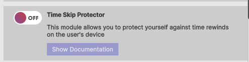
- Time Skip Protector (시간 조작 방지 모듈):사용자가 스마트폰이나 PC의 시스템 날짜/시간을 미래나 과거로 강제로 조작하는 편법을 감지하고 차단  

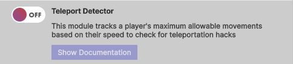
-  Teleport Detector (순간이동 감지 모듈): 플레이어의 이동 속도(Speed) 대비 이동할 수 있는 최대 허용 거리를 추적하여 비정상적인 위치 이동을 감지합니다

    - 원리: 프레임 단위 또는 일정 시간 간격으로 이전 위치와 현재 위치 사이의 거리를 계산합니다. 캐릭터의 이동 속도 상한치를 넘어 순식간에 먼 거리를 이동하면 순간이동 핵으로 판단하여 감지 이벤트를 발생시킵니다.  

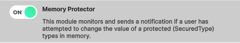
- Memory Protector (메모리 보호 모듈):GameShield의 암호화 변수(SecuredType, 예: SecuredInt, SecuredFloat 등)로 보호된 메모리 값을 외부에서 강제로 조작하려 할 때 이를 실시간으로 모니터링하고 감지 이벤트를 발생시킵니다.  

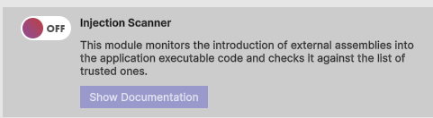
- Injection Scanner (코드 주입 스캐너):실행 중인 게임 프로세스에 허가되지 않은 외부 어셈블리(DLL/C# 라이브러리)가 주입되는지 감지합니다.

    - 원리: 정상적으로 로드된 신뢰할 수 있는 목록(Trusted Assemblies)과 비교하여, 외부에서 강제로 주입된 해킹용 코드/DLL을 발견하면 치트 시도로 판단해 감지 이벤트를 발생시킵니다.   
    
    - 주요 타겟 치트: DLL 인젝터(DLL Injector)나 변조된 C# 라이브러리를 주입하여 게임 내 내부 함수를 강제로 호출하거나 오버라이드하는 고급 변조 해크.  

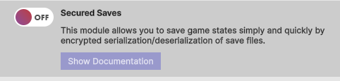
- Secured Saves (안전한 데이터 저장 모듈):게임 상태나 저장 데이터를 직렬화(Serialization) 및 역직렬화(Deserialization)할 때 데이터를 암호화하여 안전하게 처리해 주는 모듈

    - 주요 타겟 치트: 기기 내부 파일 경로에 생성된 저장 파일(JSON, XML, PlayerPrefs 등)을 메모장이나 에디터로 열어서 골드, 레벨, 아이템 수량 등을 직접 수정하는 에디팅 행위.  

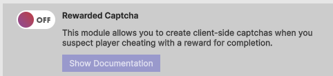
- Rewarded Captcha (보상형 캡차 모듈):의심스러운 매크로 행위가 감지되었을 때 클라이언트 단에서 캡차(문자/이미지 맞추기 등)를 띄워 자동화 봇(Bot)인지 실제 사람인지 확인

    -   보상형 방식: 매크로 검사로 인해 실제 일반 유저가 느낄 수 있는 불쾌함이나 불편함을 줄이기 위해, 캡차를 올바르게 풀고 통과했을 때 소정의 게임 내 보상(골드, 재화 등)을 제공하도록 설계되어 있습니다.

    - 주요 타겟 치트: 오토클리커, 24시간 자동 파밍 매크로 프로그램, 매크로 봇

 ---

 # 적용 및 사용법
- Memory Protector (메모리 변조 방지)
    - SecuredInt
    - SecuredFloat
    - SecuredDouble
    - SecuredLong
    - SecuredBool
    - SecuredString
    - SecuredByte
    - SecuredShort
    - SecuredVector2
    - SecuredVector3
- 변수 내장 메서드 (각 Secured 타입에서 사용)
    - GetEncrypted() / SetEncrypted(value)

        - 메모리에 실제로 저장된 암호화된 내부 값(XOR/가식화된 데이터)을 직접 가져오거나 설정합니다.

    - ApplyNewKey()

        - 해당 변수의 내부 암호화 키/마스크를 즉시 새로 변경합니다. 주기적으로 호출하여 탐지를 무력화할 수 있습니다.

    - ToString()

        - 암호화 해제된 원래 형태의 문자열로 변환합니다.

- Time Skip Protector (시간 조작 방지)  
디바이스의 시스템 시간이 강제로 변경되었는지 감지하고 이벤트를 받아 처리합니다.

```using GameShield.Detectors;
using UnityEngine;

public class TimeChecker : MonoBehaviour
{
    void Start()
    {
        // 시간 조작 감지 시 호출될 콜백 함수 등록
        TimeSkipDetector.OnTimeSkipDetected += HandleTimeSkip;
        
        // 감지 시작 (체크 간격 설정 가능)
        TimeSkipDetector.StartDetection();
    }

    void HandleTimeSkip()
    {
        Debug.LogWarning("시스템 시간 조작이 감지되었습니다!");
        // 예: 보상 획득 취소 또는 경고 팝업 창 표시
    }

    void OnDestroy()
    {
        TimeSkipDetector.OnTimeSkipDetected -= HandleTimeSkip;
    }
}
```
- Teleport Detector (순간이동 감지)
```
using GameShield.Detectors;
using UnityEngine;

public class PlayerMovementProtection : MonoBehaviour
{
    void Start()
    {
        TeleportDetector.OnTeleportDetected += HandleTeleport;
        TeleportDetector.StartDetection(transform); // 감지할 플레이어 Transform 전달
    }

    void HandleTeleport()
    {
        Debug.LogWarning("비정상적인 순간이동이 감지되었습니다!");
        // 예: 플레이어 위치를 이전 위치로 롤백하거나 캐릭터 멈춤 처리
    }

    // 정당한 포탈/스킬을 사용할 때 예외 처리하는 함수
    public void UsePortal(Vector3 targetPosition)
    {
        TeleportDetector.Pause(); // 감지 잠시 중지
        transform.position = targetPosition; // 이동
        TeleportDetector.Unpause(); // 감지 재개
    }
}
```
- Injection Scanner (외부 DLL/어셈블리 주입 감지)  
외부 라이브러리나 모드 메뉴가 주입되는 것을 실시간 스캔합니다.
```csharp
using GameShield.Detectors;
using UnityEngine;

public class InjectionChecker : MonoBehaviour
{
    void Start()
    {
        InjectionScanner.OnInjectionDetected += HandleInjection;
        InjectionScanner.StartDetection();
    }

    void HandleInjection(string assemblyName)
    {
        Debug.LogError($"비인가 DLL/어셈블리 주입 감지: {assemblyName}");
        // 보안상 즉시 게임 종료 처리 권장
        Application.Quit();
    }
}
```
- Secured Saves (안전한 데이터 암호화 저장)  
PlayerPrefs 대신 사용하거나 게임 데이터를 JSON 등으로 암호화하여 저장할 때 사용합니다.
```csharp
using GameShield.Saves;
using UnityEngine;

public class SaveManager : MonoBehaviour
{
    public void SaveGameData()
    {
        // PlayerPrefs와 동일한 방식으로 암호화 저장
        SecuredSaves.SetInt("UserGold", 1000);
        SecuredSaves.SetString("UserName", "Player1");
        SecuredSaves.Save(); // 저장 적용
    }

    public void LoadGameData()
    {
        int gold = SecuredSaves.GetInt("UserGold", 0);
        string name = SecuredSaves.GetString("UserName", "Guest");
        Debug.Log($"불러온 데이터 - 이름: {name}, 골드: {gold}");
    }
}
```
- Rewarded Captcha (보상형 캡차)   
매크로 의심 시 캡차 화면을 띄우고 결과에 따라 처리합니다.
```csharp
using GameShield.Captcha;
using UnityEngine;

public class CaptchaManager : MonoBehaviour
{
    public void TriggerCaptcha()
    {
        // 캡차 표시 요청
        CaptchaModule.ShowCaptcha(OnCaptchaResult);
    }

    void OnCaptchaResult(bool success)
    {
        if (success)
        {
            Debug.Log("캡차 통과! 보상을 지급합니다.");
            // 보상 아이템/재화 지급 로직
        }
        else
        {
            Debug.LogWarning("캡차 실패/취소! 매크로 유저로 판단합니다.");
            // 게임 이용 제한 또는 보상 차단
        }
    }
}
```
- EventMessenger : GameShield에서 보안 위협 탐지, 시스템 알림, 내부 이벤트 전송 등을 중앙에서 통합 관리하는 싱글톤 기반의 중앙 이벤트 메신저(Event Bus) 시스템

보안 탐지 모듈(MemoryProtector, SpeedHackDetector, InjectionScanner 등)이 각각 개별 이벤트를 노출하는 대신, 중앙의 EventMessenger를 통해 Payload(데이터 패키지) 형태로 알림을 발행(Publish)하고 수신(Subscribe)하도록 설계되어 있습니다.